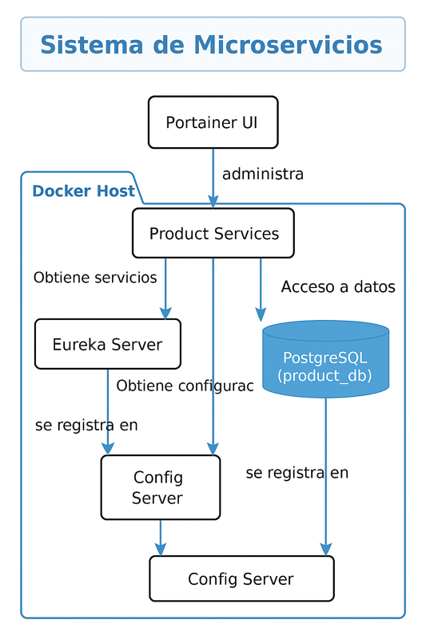

Actualiza la documentación # 📦 Inventory Microservices System

Sistema de microservicios desarrollado con Java Spring Boot, Gradle, PostgreSQL y Docker, orientado a la gestión de productos, configuración y descubrimiento de servicios.

---

## 🛠️ Tecnologías utilizadas

- Java 17
- Spring Boot 3.x
- Spring Cloud (Eureka, Config Server)
- Gradle
- PostgreSQL
- Docker & Docker Compose
- Portainer (opcional)
- Makefile para automatización

---
## 📁 Estructura del proyecto
```bash

inventory-ms/
│
├── config-service/             # Microservicio de configuración centralizada
├── discovery-service/          # Microservicio Eureka (Service Discovery)
├── product-service/            # Microservicio de productos
├── infra/                      # Infraestructura Docker
│   └── docker-compose.yml
├── Makefile                    # Automatización de tareas
├── .env.local                  # Configuración local
├── .env.dev                    # Configuración desarrollo
├── .env.prod                   # Configuración producción
└── README.md
---
```

## 🚀 Configuración y levantamiento por entorno (`local`, `dev`, `prod`)

Este proyecto usa `Makefile` y archivos `.env` para facilitar el levantamiento de entornos con Docker Compose.

---

### 📁 1. Crear archivos `.env` por entorno

Crea los siguientes archivos en la raíz del proyecto.

#### ✅ `.env.local`

```env
SPRING_PROFILES_ACTIVE=local
DISCOVERY_PORT=8761
CONFIG_PORT=7777
PRODUCT_PORT=9091
JAVA_OPTS=-Xms128m -Xmx256m
DISCOVERY_SERVICE_HEALTH_URL=http://discovery-service:8761/actuator/health
CONFIG_SERVICE_HEALTH_URL=http://config-service:7777/actuator/health
GIT_USERNAME=your_git_username
GIT_TOKEN=your_github_token
EUREKA_HOST=localhost
DB_HOST=localhost
DB_PORT=5432
DB_NAME=product
DB_USERNAME=postgres
DB_PASSWORD=postgres
```

✅ .env.dev y .env.prod
```
Puedes basarte en .env.local y modificar lo siguiente según el entorno:
	•	SPRING_PROFILES_ACTIVE=dev o prod
	•	DB_HOST, GIT_TOKEN, puertos, etc.
```
⸻

⚙️ 2. Comandos disponibles con make

▶️ Levantar el entorno deseado
```
make up-local     # Ambiente local
make up-dev       # Ambiente de desarrollo
make up-prod      # Ambiente de producción
```

🛑 Detener todos los servicios
make down
```
🧼 Limpiar recursos de Docker
make clean-images    # Elimina imágenes no usadas
make clean-volumes   # Elimina volúmenes no usados
make clean-all       # Elimina todo lo no utilizado
```
```
📊 Administración con Portainer (opcional)

Portainer es una herramienta visual para administrar contenedores Docker desde el navegador.

🔼 Iniciar Portainer
make portainer-up

	•	Abre http://localhost:9000 en el navegador
	•	Crea un usuario admin si es tu primer uso

🔽 Detener Portainer
make portainer-stop

🔍 Logs de Portainer
make portainer-logs

🧠 Recomendaciones
	•	❌ No uses credenciales reales (como GIT_TOKEN) en archivos .env versionados.
	•	✅ Asegúrate de agregar .env.local, .env.dev, .env.prod al .gitignore.
	•	🔐 En producción, usa docker secrets, Vault o variables de entorno seguras desde CI/CD.
	•	🔒 Portainer es útil en desarrollo, pero debe limitarse o eliminarse en producción.

⸻

```

```
✍️ Edición del Makefile

Para modificar comandos personalizados, edita el Makefile:
nano Makefile


⸻
```

✅ Ejecución de contenedores por entorno
```
make up-dev      # Levantar ambiente de desarrollo
make up-local    # Levantar ambiente local
make up-prod     # Levantar ambiente de producción
```

🧪 Verificación del entorno
```
docker exec -it config-service printenv SPRING_PROFILES_ACTIVE
docker exec -it config-service printenv EUREKA_HOST
```

🔐 Acceso a Portainer (por defecto)
```
URL:      http://localhost:9000
Usuario:  admin
Clave:    ce1234567891
```

```
🐳 Comando manual para levantar Portainer (fuera de Makefile)
docker run -d \
  -p 9000:9000 \
  --name portainer \
  --restart=unless-stopped \
  --cpus="0.25" \
  --memory="150m" \
  -v /var/run/docker.sock:/var/run/docker.sock \
  -v portainer_data:/data \
  portainer/portainer-ce:latest
```

```
✅ Flujo recomendado
1.	Ejecuta Portainer si lo necesitas:
make portainer-up

2.	Luego, según el entorno:
make up-local
make up-dev
make up-prod
```
## Puertos recomendados para microservicios


| Microservicio            | Puerto en Docker (`docker-compose`)   | Puerto local (IntelliJ o CLI)   |
|--------------------------|---------------------------------------|---------------------------------|
| `api-gateway`            | `8080:8080`                           | `8080`                          |
| ------------------------ | ------------------------------------- | ------------------------------- |
| `discovery-service`      | `8761:8761`                           | `8761`                          |
| ------------------------ | ------------------------------------- | ------------------------------- |
| `config-service`         | `7777:7777`                           | `7777`                          |
| ------------------------ | ------------------------------------- | ------------------------------- |
| `product-service`        | `9090:9090`                           | `9090`                          |
| ------------------------ | ------------------------------------- | ------------------------------- |
| `inventory-service`      | `9091:9091`                           | `9091`                          |
| ------------------------ | ------------------------------------- | ------------------------------- |
| `order-service`          | `9092:9092`                           | `9092`                          |
| ------------------------ | ------------------------------------- | ------------------------------- |
| `supplier-service`       | `9093:9093`                           | `9093`                          |
| ------------------------ | ------------------------------------- | ------------------------------- |
| `notification-service`   | `9094:9094`                           | `9094`                          |

🗺️ Arquitectura general del sistema




📄 Licencia

Este proyecto se distribuye bajo la licencia MIT. Con esto que se modificó en Makefile # Variables
ENV_FILE_LOCAL?=.env.local
ENV_FILE_DEV?=.env.dev
ENV_FILE_PROD?=.env.prod
# Levantar con archivo .env actual (puedes exportar ENV_FILE para cambiarlo)

up-local:
cp $(ENV_FILE_LOCAL) .env
docker compose down -v
docker compose --env-file $(ENV_FILE_LOCAL) up --build

up-dev:
cp $(ENV_FILE_DEV) .env
docker compose down -v
docker compose --env-file $(ENV_FILE_DEV) up --build

up-prod:
cp $(ENV_FILE_PROD) .env
docker compose down -v
docker compose --env-file $(ENV_FILE_PROD) up --build


build-images:
docker build -t inventory/discovery-service ../discovery-service
docker build -t inventory/config-service ../config-service
docker build -t inventory/product-service ../product-service


