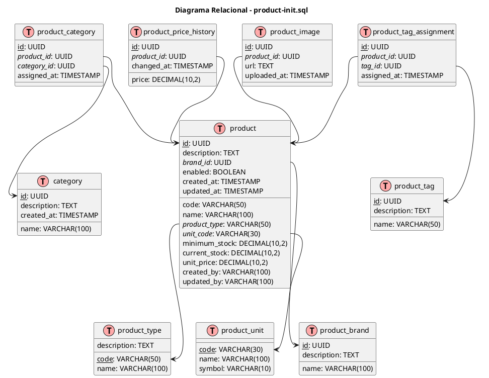
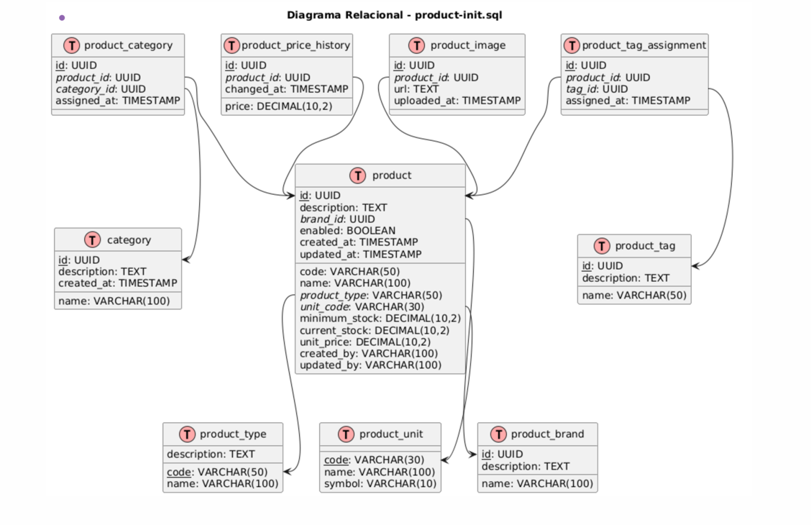
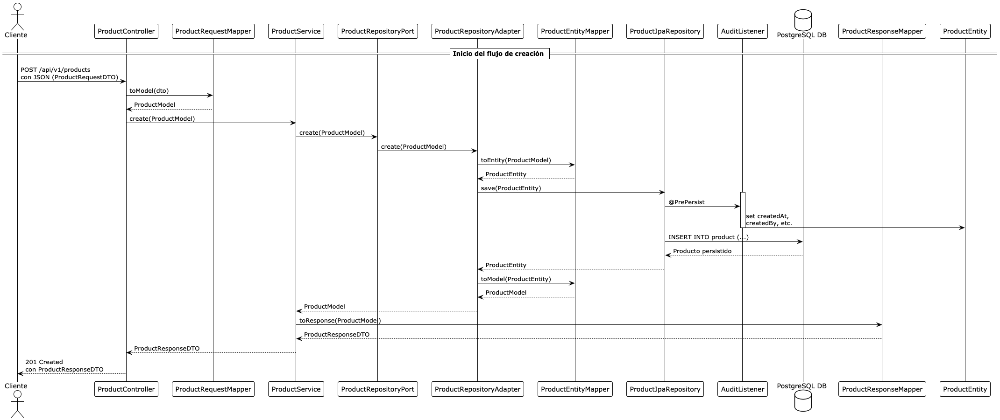

# Getting Started

### Reference Documentation

For further reference, please consider the following sections:

* [Official Gradle documentation](https://docs.gradle.org)
* [Spring Boot Gradle Plugin Reference Guide](https://docs.spring.io/spring-boot/3.4.5/gradle-plugin)
* [Create an OCI image](https://docs.spring.io/spring-boot/3.4.5/gradle-plugin/packaging-oci-image.html)
* [Config Client](https://docs.spring.io/spring-cloud-config/reference/client.html)
* [Eureka Discovery Client](https://docs.spring.io/spring-cloud-netflix/reference/spring-cloud-netflix.html#_service_discovery_eureka_clients)
* [Spring Data JPA](https://docs.spring.io/spring-boot/3.4.5/reference/data/sql.html#data.sql.jpa-and-spring-data)
* [Spring Boot DevTools](https://docs.spring.io/spring-boot/3.4.5/reference/using/devtools.html)
* [Spring Web](https://docs.spring.io/spring-boot/3.4.5/reference/web/servlet.html)

### Guides

The following guides illustrate how to use some features concretely:

* [Service Registration and Discovery with Eureka and Spring Cloud](https://spring.io/guides/gs/service-registration-and-discovery/)
* [Accessing Data with JPA](https://spring.io/guides/gs/accessing-data-jpa/)
* [Building a RESTful Web Service](https://spring.io/guides/gs/rest-service/)
* [Serving Web Content with Spring MVC](https://spring.io/guides/gs/serving-web-content/)
* [Building REST services with Spring](https://spring.io/guides/tutorials/rest/)

### Additional Links

These additional references should also help you:

* [Gradle Build Scans – insights for your project's build](https://scans.gradle.com#gradle)

### Test Execution and Coverage Report

You can execute the tests and generate the Jacoco coverage report using the following Gradle commands:

```bash
# Run all tests and generate the Jacoco report
./gradlew clean test jacocoTestReport

# Verify coverage threshold (adjust the limit in build.gradle if needed)
./gradlew jacocoTestCoverageVerification
```

The generated report will be available at:

```
build/reports/jacoco/test/html/index.html
```

To open the report:

* On macOS/Linux:

```bash
open build/reports/jacoco/test/html/index.html
```

* On Windows:

```bash
start build/reports/jacoco/test/html/index.html
```

If the file does not exist, make sure the tests ran successfully and the `jacocoTestReport` task completed without errors.

## Puertos recomendados para microservicios

| Microservicio          | Puerto en Docker (`docker-compose`) | Puerto local (IntelliJ o CLI) |
| ---------------------- |-------------------------------------|-------------------------------|
| `api-gateway`          | `8081:8081`                         | `8081`                        |
| `discovery-service`    | `8761:8761`                         | `8761`                        |
| `config-service`       | `7777:7777`                         | `7777`                        |
| `product-service`      | `9090:9090`                         | `9090`                        |
| `inventory-service`    | `9091:9091`                         | `9091`                        |
| `order-service`        | `9092:9092`                         | `9092`                        |
| `supplier-service`     | `9093:9093`                         | `9093`                        |
| `notification-service` | `9094:9094`                         | `9094`                        |

# Modelo Relacional de Datos



# Modelo Relacional de Datos




